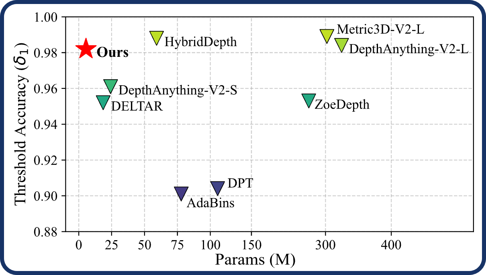

<div align="center">
<h2>LiteSense: Lifting Lightweight ToF with RGB for Metric Depth Estimation</h2>

[**Yusheng Li**](https://lyshengtr.github.io/) · [**Lizhi Lou**](https://celiang.tongji.edu.cn/info/1301/2410.htm) · [**Yan Tang**](http://kenanking.github.io/) · [**Zekai Miao**](http://miao16.github.io/) · [**Shaoming Zhang<sup>&dagger;</sup>**](https://celiang.tongji.edu.cn/info/1301/2420.htm) · [**Jianmei Wang**](https://celiang.tongji.edu.cn/info/1301/3085.htm)

College of Surveying and Geo-infomatics, Tongji University

**CVPR 2026 Highlight**

<a href="https://openaccess.thecvf.com/content/CVPR2026/papers/Li_LiteSense_Lifting_Lightweight_ToF_with_RGB_for_High-Resolution_Metric_Depth_CVPR_2026_paper.pdf"></a>
<a href='https://openaccess.thecvf.com/content/CVPR2026/supplemental/Li_LiteSense_Lifting_Lightweight_CVPR_2026_supplemental.pdf'></a>
</div>

This work presents LiteSense, a lightweight 5M-parameter network that integrates CNH-based compact ToF sensing with RGB imagery to achieve accurate metric depth estimation.

<p align="center">
  
  
</p>


## News

* **2026-06-08** : Paper and codes are released.
* **2026-02-23** : LiteSense is accepted by CVPR 2026.


## Performance

Quantitative comparison results on NYU Depth V2 indoor benchmark are reported below.

| Methods | δ₁ ↑ | RMSE ↓ (m) | AbsRel ↓ | #Params ↓ (M) | #FLOPs ↓ (G) |
|----------|------|------------|-----------|---------------|--------------|
| ***Monocular Depth Estimation*** |||||| 
| AdaBins | 0.903 | 0.364 | 0.103 | 77.89 | 210.20 |
| UniDepth | 0.984 | 0.201 | 0.057 | 345.53 | 1053.21 |
| ZoeDepth | 0.953 | 0.277 | 0.077 | 266.16 | 428.92 |
| Metric3D-V2-L | 0.989 | <u>0.183</u> | *0.047* | 302.91 | 548.05 |
| DepthAnything-V2-L | <u>0.984</u> | 0.206 | 0.056 | 332.68 | 1171.97 |
| DepthAnything-V2-S | 0.961 | 0.228 | 0.063 | *24.18* | *82.61* |
| HybridDepth | **0.989** | **0.128** | **0.026** | 59.15 | 377.82 |
| ***Auxiliary-Guided MDE*** ||||||
| PriorDA-S* | 0.843 | 0.697 | 0.134 | 48.58 | 163.83 |
| DELTAR | 0.952 | 0.311 | 0.064 | <u>18.55</u> | <u>79.98</u> |
| **LiteSense (Ours)** | *0.982* | *0.197* | <u>0.029</u> | **5.48** | **33.87** |

We highlight the **best** and *second best* results in **bold** and *italic* respectively (**better results**: RMSE $\downarrow$ ,AbsRel $\downarrow$ , $\delta_1 \uparrow$).


## Usage

### Installation

```bash
git clone https://github.com/TJ-CVRSG/LiteSense.git
cd LiteSense
pip install -r requirements.txt
```

### Data Preparation

* General Operation:
  * Store data in paired files, for example: ``fileRootName_rgb.jpg (uint8)`` and ``fileRootName_depth.png (uint16)``, where the depth map is stored in millimeters.
  * Create file lists for training or validation data in the following format:
    ```json
    {
        "train": [
            {
            "filename": "path/to/fileRootName"
            },
            {
            "filename": "path/to/fileRootName"
            },
            ...
        ]
            "test": [
            {
            "filename": "path/to/fileRootName"
            },
            ...
        ]
    }
    ```

* For NYU Depth V2:
  * Downloads: For the test set, download the official [Labeled Dataset](https://cs.nyu.edu/~fergus/datasets/nyu_depth_v2.html). For the training set, following the commonly used subset adopted in previous works, download the prepared raw data from the Google Drive provided by [BTS](https://github.com/saeid-h/bts-fully-tf-v2).
  * Preprocess: Use the official [ToolBox](https://cs.nyu.edu/~fergus/datasets/nyu_depth_v2.html) to interpolate the raw depth data and fill in missing regions. (**Note:** Due to the projection process, the image resolution changes from *640×480* to *561×427* after interpolation. For details, please refer to the official parameters in ``get_projection_mask.m``.)

* For THDR3K:
  * Downloads: We have uploaded the collected and organized indoor CNH-ToF-RGB dataset to [Google Drive](https://drive.google.com/file/d/1YhEKEvQARr1c0OW348XC8rwQSIoltAOS/view?usp=drive_link).
  * Data Format: The RGB images and depth maps captured by RealSense follow the same data format as the previously used public datasets. The ToF data collected by VL53L8CH are stored as text files, mainly containing entries such as ``nb_target_detected``, ``distance_mm``, and ``cnh_data``. Detailed descriptions of these fields can be found in the series of [Documents](https://www.st.com.cn/zh/imaging-and-photonics-solutions/vl53l8ch.html#documentation) provided by STM, the sensor vendor.
  * Preprocess: The current ToF sensor only updates valid measurements during data transmission and does not clear invalid values. Therefore, ``nb_target_detected`` must be used to mask the actually valid measurements in each frame. In addition, due to hardware installation constraints, there is an orientation discrepancy between the ToF sensor and the RGB camera. To ensure correct spatial alignment and overlapping coverage, the ToF data must be transformed to the proper orientation.
    ```python
    # mask invalid data
    tof = np.array(distance_mm, dtype=np.float32).reshape(rows, cols)
    mask = np.array(nb_target_detected, dtype=np.float32).reshape(rows, cols)
    tof[mask == 0] = 0.0

    # rotate tof data to align with rgb
    tof = np.rot90(tof, k=1).copy()
    cnh = np.rot90(cnh, k=1).copy()
    ```

### Configuration

* ToF Data Configs: 
  Configure the pixel alignment information for the low-resolution ToF sensor and the physical parameters used in simulation.
  ```python
  parser.add_argument("--zone-size", type=int, default=52, help="Size of each zone cell in pixels")
  parser.add_argument("--zone-grid-rows", type=int, default=8, help="Number of zone grid rows")
  parser.add_argument("--zone-grid-cols", type=int, default=8, help="Number of zone grid columns")
  parser.add_argument("--sim-cnh-bins", type=int, default=18, help="Number of CNH histogram bins")
  parser.add_argument("--sim-cnh-range", type=float, default=5.4, help="CNH histogram range in meters")
  parser.add_argument("--sim-dis-max", type=float, default=4.0, help="Maximum distance in meters")
  ```
   When performing prediction only, additional alignment position information must be provided. During training and evaluation, this operation is applied automatically as a fixed preprocessing step in the dataloader.
  ```python
  parser.add_argument("--zone-x", type=int, default=60, help="ToF zone left x for prediction")
  parser.add_argument("--zone-y", type=int, default=0, help="ToF zone top y for prediction")
  ```

* Pipeline Configs: 
  * ``--input-width / height`` specifies the maximum pixel range to which the ToF data can be aligned, rather than the actual input image size of the model. When setting these values, ensure that they do not exceed the resolution of the original data, as no interpolation is applied to the raw depth data in order to preserve the authenticity of depth measurements.
  * ``--weights`` specifies the checkpoint path required for evaluation or prediction. ``--resume`` and ``--pretrain`` specify optional checkpoint paths used during training.
  * ``--data`` specifies the directory containing the prediction data. Samples in the directory should be organized as paired data following either the NYUv2 or THDR3K format, depending on whether they are synthetic or real-world data. Enabling ``--with-tof-data`` indicates that the input data follows the THDR3K format.

### Experiment

After preparing the required datasets, you can quickly start experiments using the provided preset configuration files.
```bash
python train.py    --config ./config/train_nyu.txt
python evaluate.py --config ./config/evaluate_nyu.txt
python predict.py  --config ./config/predict_thdr.txt
```

## Acknowledgement

We would like to thank [@jaiwei](https://jaiwei98.github.io) for the PyTorch implementation of [MobileNetV4](https://arxiv.org/abs/2404.10518), which enabled us to use and further adapt this model in our work.

## Citation

If you find this project useful, please consider citing:

```bibtex
@InProceedings{Li_2026_CVPR,
    author    = {Li, Yusheng and Lou, Lizhi and Tang, Yan and Miao, Zekai and Zhang, Shaoming and Wang, Jianmei},
    title     = {LiteSense: Lifting Lightweight ToF with RGB for High-Resolution Metric Depth Estimation},
    booktitle = {Proceedings of the IEEE/CVF Conference on Computer Vision and Pattern Recognition (CVPR)},
    month     = {June},
    year      = {2026},
    pages     = {5783-5792}
}
```
